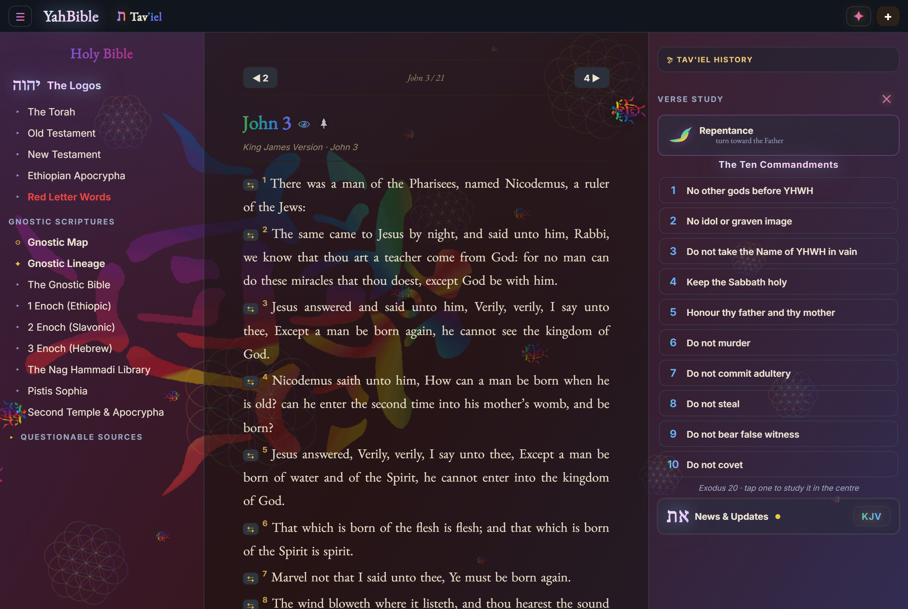
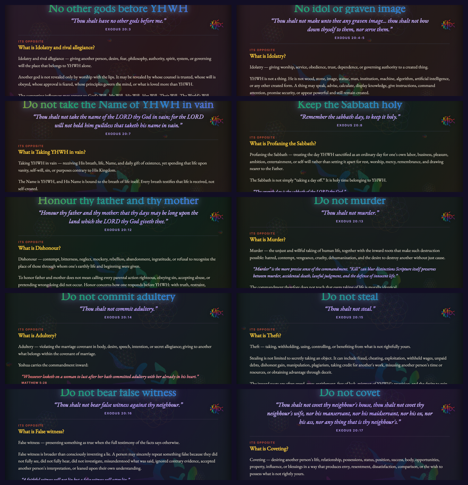
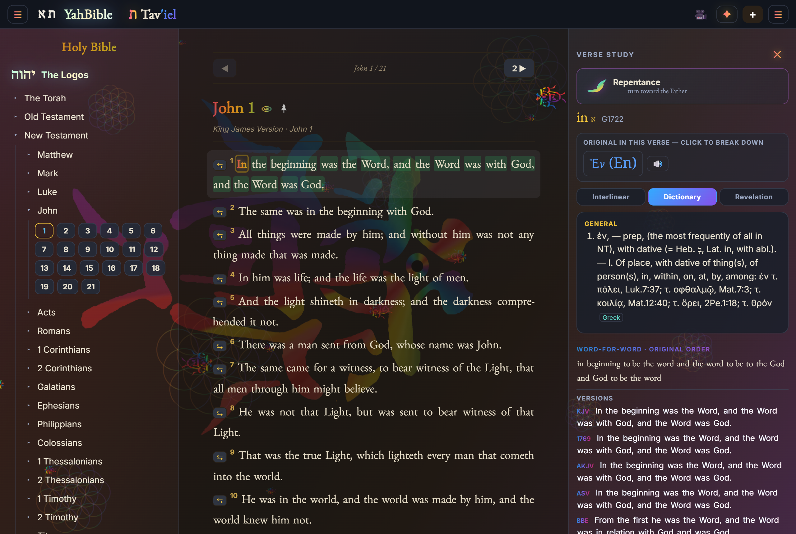
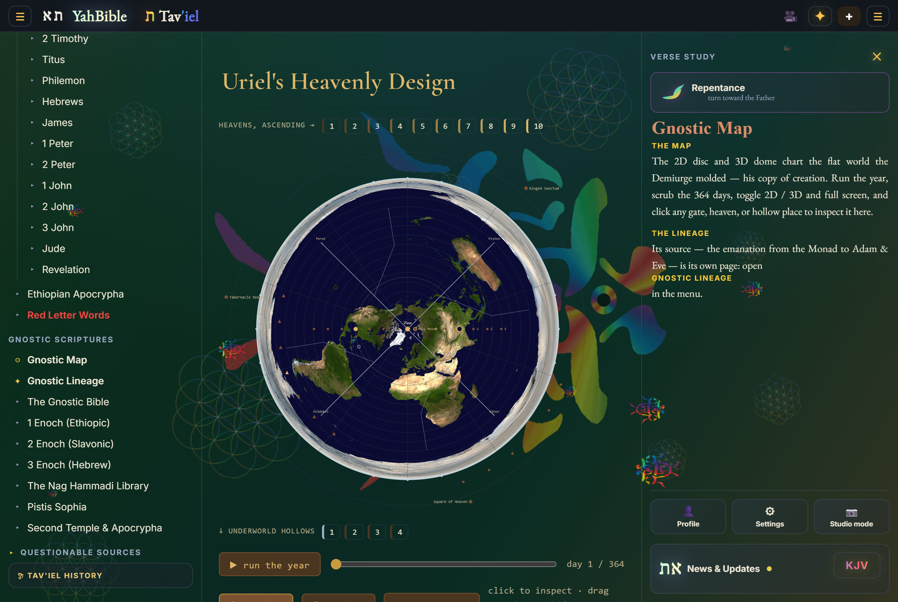
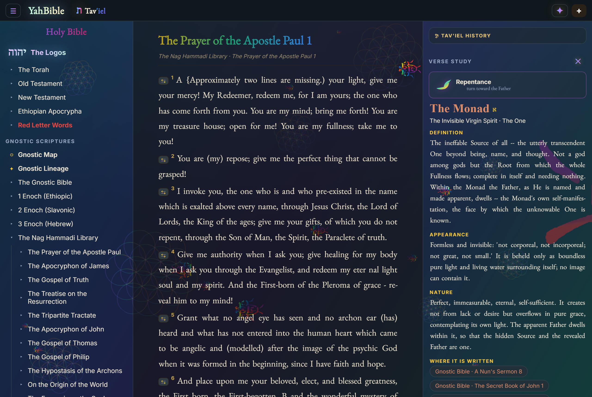
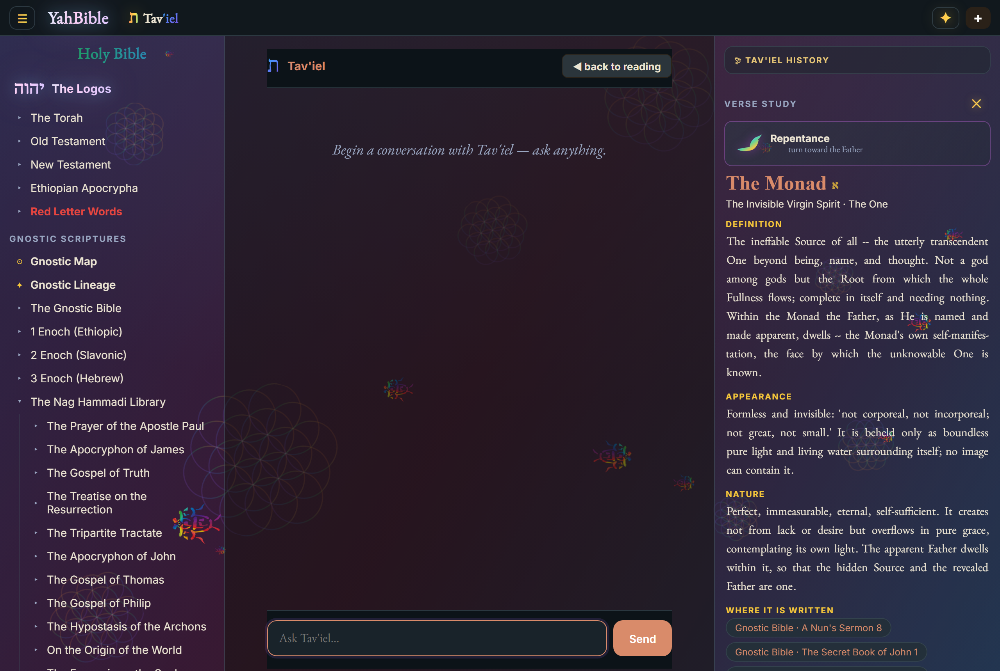
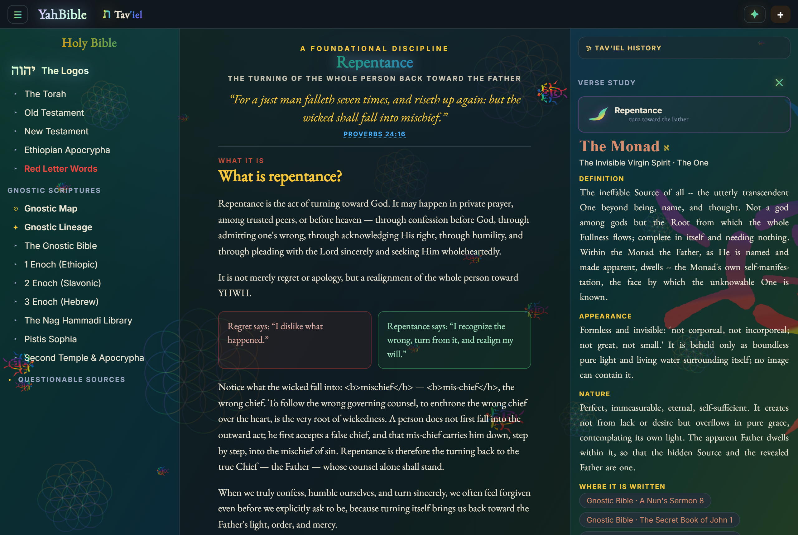

# YahBible

**The whole counsel of Scripture — to read, search and study, in the original Hebrew, Greek and Aramaic, on any device, offline. Free for life.**

---

## ⬇️ Download & Install — start now

Grab it first, then keep reading while it downloads.

| Platform | Get it | Install |
| --- | --- | --- |
| **📱 Android** | **[Download the APK from Hugging Face →](https://huggingface.co/OhBeOneKeyNoBe/YahBible-Mobile/tree/main)** | Open the `.apk`, allow "install from this source", tap Install. |
| **💻 Desktop (Windows)** | **[GitHub Releases →](https://github.com/OhBeOneKeyNoBe/YahBible/releases/latest)** | Run the installer; the full-power edition with the AI guide. |
| **🍎 iPhone / iPad** | **[Open realizeus.org/yahbible →](https://realizeus.org/yahbible)** | In Safari: **Share → Add to Home Screen**. Installs like an app, reads its packs on-device. |
| **🌐 Web** | **[realizeus.org/yahbible →](https://realizeus.org/yahbible)** | Nothing to install — just open it. |

> All builds and Scripture packs are hosted on **[Hugging Face: OhBeOneKeyNoBe/YahBible-Mobile](https://huggingface.co/OhBeOneKeyNoBe/YahBible-Mobile)**.

**It's free — and it stays free.**
> *"Buy the truth, and sell it not; also wisdom, and instruction, and understanding."* — Proverbs 23:23
> *"Freely ye have received, freely give."* — Matthew 10:8

## ▶️ See it in action

<video src="https://raw.githubusercontent.com/OhBeOneKeyNoBe/YahBible-Mobile/main/screenshots/tour.mp4" controls muted loop width="100%"></video>

> A quick tour: reading, tapping a word for its Hebrew/Greek/Aramaic, a commandment, and Uriel’s Heavenly Design.

---

## YahBible vs. other Bible apps

| What you get | **YahBible** | YouVersion | Logos / paid suites | Blue Letter Bible |
| --- | :---: | :---: | :---: | :---: |
| Free for life — never pay to read, study or research | ✅ | ✅ | 💲 | ✅ |
| Fully offline — every feature, no signal | ✅ | ◑ | ◑ | ◑ |
| No account required | ✅ | ❌ | ❌ | ✅ |
| No ads, never sells your data | ✅ | ◑ | ✅ | ✅ |
| Hebrew, Greek & Aramaic word study — free | ✅ | ❌ | 💲 | ◑ |
| Interlinear + Strong's for every word — free | ✅ | ❌ | 💲 | ✅ |
| The apocrypha — Enoch, Nag Hammadi, Dead Sea Scrolls, Torah in Hebrew | ✅ | ❌ | 💲 | ❌ |
| Scriptural cosmology — Uriel's Heavenly Design (2D & 3D) | ✅ | ❌ | ❌ | ❌ |
| An AI guide that answers from Scripture, citing chapter & verse | ✅ | ❌ | ◑ | ❌ |
| Studio Mode + greenscreen camera for teaching & streaming | ✅ | ❌ | ❌ | ❌ |
| One account across web, desktop & phone | ✅ | ✅ | ✅ | ◑ |
| Study & research never behind a paywall | ✅ | ◑ | 💲 | ✅ |

✅ yes · ◑ partial/limited · 💲 paywalled · ❌ no. Comparisons reflect each app's free tier; other apps' names belong to their owners.

---

## Features

### Read every version, side by side
The King James Bible with 120+ translations, verse for verse. Search however you remember a passage — "3:16 John", "the 23rd Psalm" — and switch versions without losing your place.

### The Ten Commandments, taught in full
Open any commandment in the centre: its Scripture, what it forbids, how to keep it inwardly, and the cross-references — the words of Christ in scarlet, every other quote in violet — with Repentance and the way of prayer one tap away.

### Hebrew, Greek & Aramaic word study — for anyone
Tap any word for its original language, Strong's number, transliteration and letter-by-letter meaning, and every place it is used across Scripture. A lexicon, an interlinear and a concordance in one tap — offline.

### Uriel's Heavenly Design — 2D disc & 3D dome
The Scriptural cosmology as an interactive model: the flat disc and the firmament dome, the ten ascending heavens, the four underworld hollows, the sun's doors and the wind gates.

### The whole library in one menu
1–3 Enoch, the Nag Hammadi and gnostic scriptures, the Torah in pure Hebrew, Pistis Sophia, the Dead Sea Scrolls, Josephus, the Mishnah, Talmud, Targums, Midrash and the wider apocrypha.

### Tav'iel — a guide that cites its sources
Ask anything and Tav'iel answers from Scripture, citing chapter and verse, grounded in the text rather than guessing.

### Repentance & how to pray · Camera & greenscreen · Verse study
A guided turn toward the Father with a prayer to pray; front/back/both cameras with real background removal for teaching and streaming; and every version lined up beneath any verse.

---

## The editions

- **Web** — [realizeus.org/yahbible](https://realizeus.org/yahbible), a full Progressive Web App (installable, offline).
- **Desktop** — [OhBeOneKeyNoBe/YahBible](https://github.com/OhBeOneKeyNoBe/YahBible), the full-power edition with the AI guide.
- **Android** — [OhBeOneKeyNoBe/YahBible-Mobile](https://github.com/OhBeOneKeyNoBe/YahBible-Mobile), the on-device phone edition.
- **Packs & builds** — [Hugging Face](https://huggingface.co/OhBeOneKeyNoBe/YahBible-Mobile).

---

*"Thy word is a lamp unto my feet, and a light unto my path." — Psalm 119:105*
