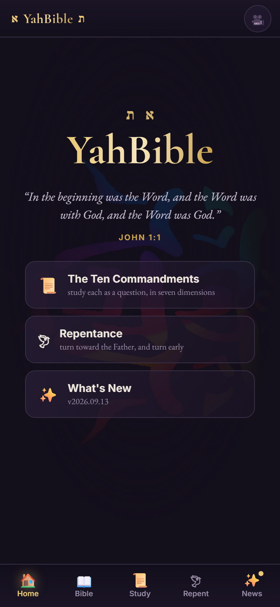
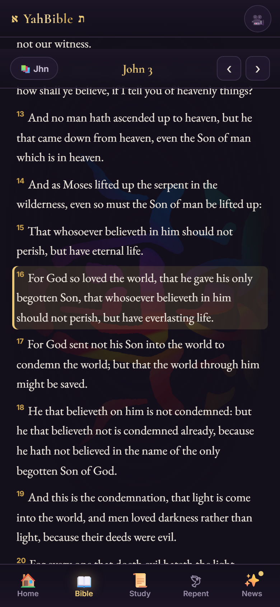
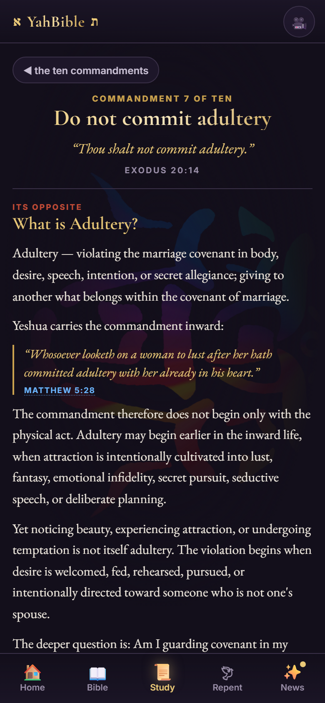
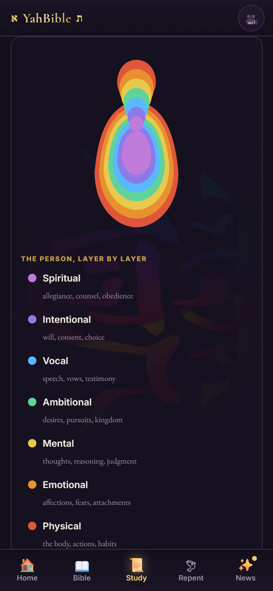
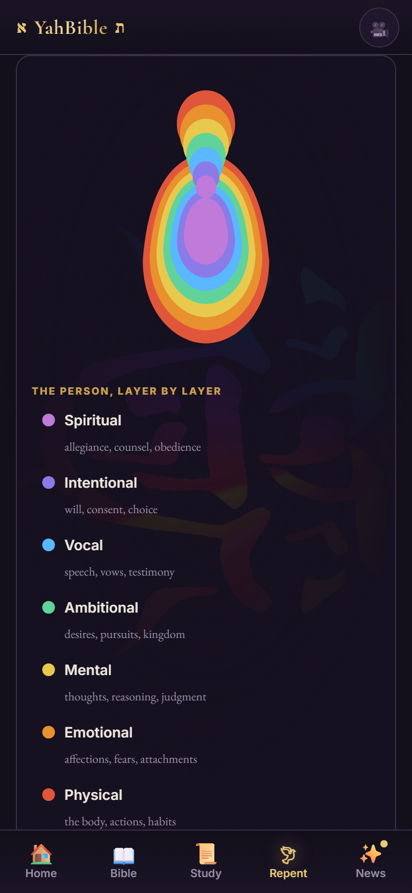
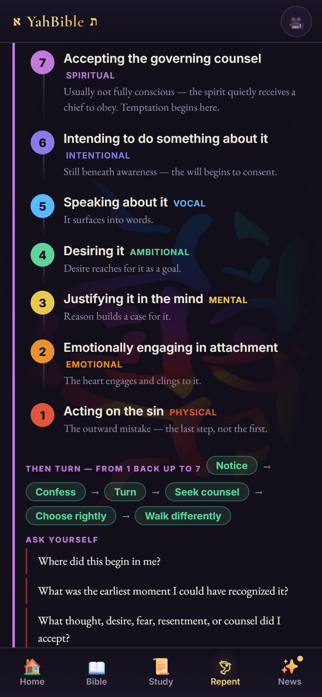
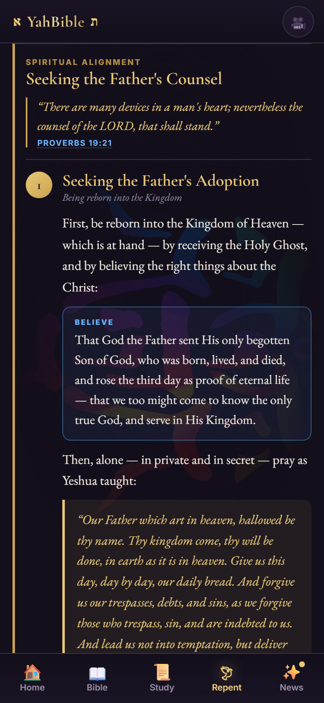
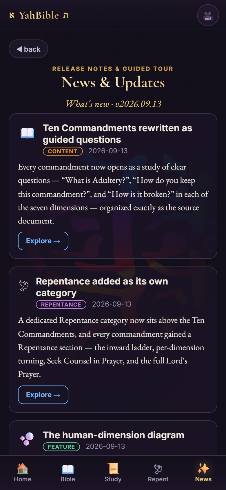

# YahBible Mobile

The mobile edition of **YahBible** — an offline scripture‑study app. A phone‑first, fully‑offline
web UI (`www/`) wrapped in a lightweight native **Android WebView** shell, so it installs as a real
Android app and needs no internet and no server.

- 🖥️ Desktop edition: **YahBible** — [Hugging Face](https://huggingface.co/OhBeOneKeyNoBe/YahBible)
- 🌐 Creator: [RealizeUS.me/@yahwehtsidkenu](https://www.realizeus.me/@yahwehtsidkenu)

---

## Features

| | |
|---|---|
|  | **Home** — the YahBible wordmark (א YahBible ת), the holy‑fish backdrop, and a rotating verse. Five tabs: Home · Bible · Study · Repent · News. |
|  | **Offline KJV Bible** — all 66 books, 31,102 verses, bundled in the app. Book → chapter → reader, with verse highlighting and prev/next. Every scripture reference anywhere in the app opens the reader at that verse. |
|  | **The Ten Commandments, as questions** — each commandment opens as a study of clear questions: *“What is Adultery?”*, *“How do you keep this commandment?”*, and *“How is it broken?”* in each of the seven inward dimensions. |
|  | **The seven dimensions** — 🔴 Physical · 🟠 Emotional · 🟡 Mental · 🟢 Ambitional · 🔵 Vocal · 🟣 Intentional · 🟪 Spiritual — each an accordion with examples, scripture, and how to keep it. |
|  | **Where sin forms** — an interactive figure of the person in seven nested layers, spirit at the core (violet) to flesh on the surface (scarlet). Tap a layer to open its dimension. |
|  | **The inward ladder** — a countdown 7→1, from the spirit down to the outward act, so you learn to see (and turn from) sin earlier. |
|  | **Seeking the Father’s Counsel** — three steps (Adoption · Counsel · Blessings), the full Lord’s Prayer, and *Seek Counsel in Prayer* as a guided flow. |
|  | **News & Updates** — a release‑notes and guided‑tour feed; the tab shows a dot until you’ve read what’s new. |

Plus a **draggable self‑cam overlay** (circle / green‑screen) for streaming, and the app is
categorised as a **game** for store placement.

---

## Build it yourself

The web UI in `www/` is a self‑contained offline app — open `www/index.html` in a browser (phone
width) to preview it. The Android shell in `android/` bundles `www/` into `assets/web/`.

**Requirements:** JDK 17, the Android SDK (platform‑34, build‑tools 34) — no NDK/Rust (pure WebView).

```bash
cd android
echo "sdk.dir=/path/to/Android/sdk" > local.properties
./gradlew assembleDebug          # -> app/build/outputs/apk/debug/app-debug.apk
```

Install on a device: `adb install app/build/outputs/apk/debug/app-debug.apk`.

---

## Layout

```
YahBible-Mobile/
  www/                 the offline web UI (Home / Bible / Ten Commandments / Repentance / News)
    index.html  app.js  app.css  fonts.css
    data/              bundled content: KJV, commandments, repentance, news
    fonts/  assets/
  android/             native WebView shell (me.realizeus.yahbible), bundles www/ into assets/web
  docs/screenshots/    the images above
```

## Content note

Study content is generated from the desktop YahBible’s single source and bundled offline. The KJV
text is public domain. The app is a devotional/study tool; the internal desktop pipeline is separate.
