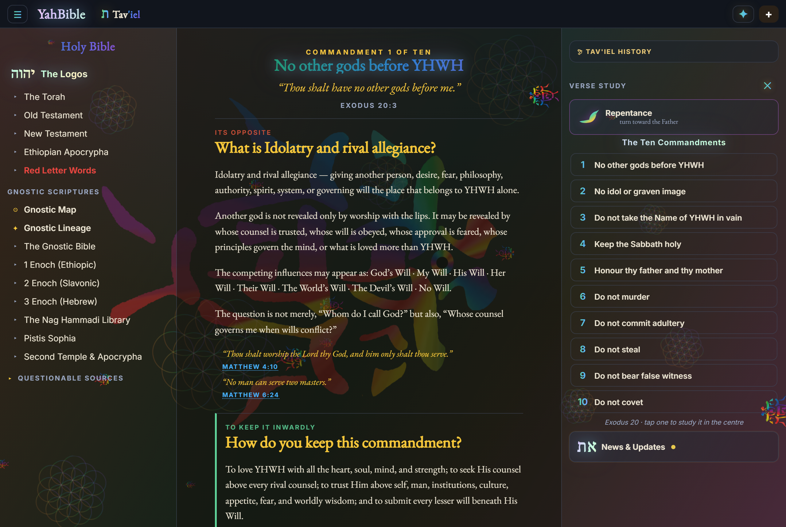
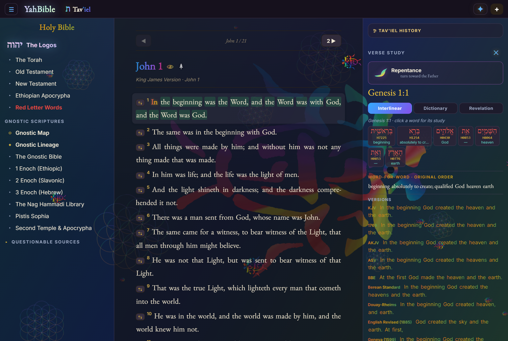
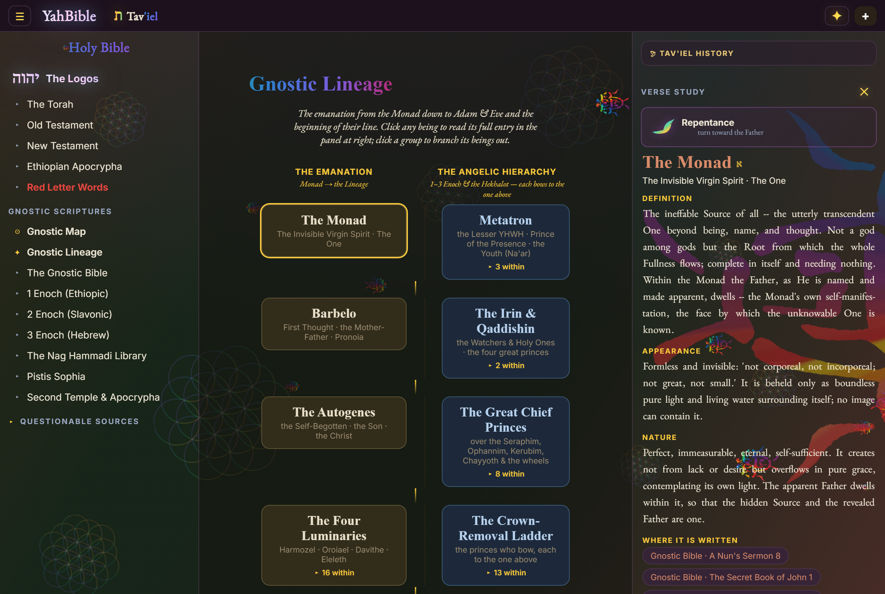
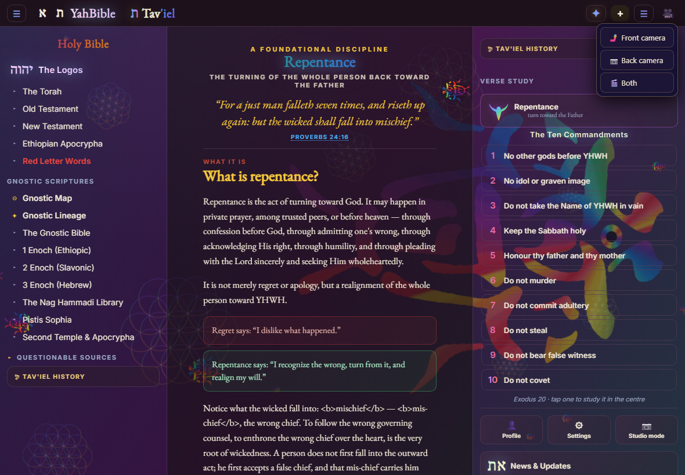

# YahBible

**The whole counsel of Scripture — to read, search and study, in the original Hebrew, Greek and Aramaic, on any device, offline.**

YahBible gathers the King James Bible and 120+ translations, a full Hebrew/Greek/Aramaic word-study engine, the apocryphal and second-temple library, the Scriptural cosmology, and a grounded study guide into one app — on the web, on the desktop, and on your phone. Install it once and it works with no connection at all.

**Read it now:** <https://realizeus.org/yahbible> · Part of [RealizeUS](https://realizeus.org)

---

## The problems YahBible solves

| The problem | What YahBible does |
| --- | --- |
| Study is scattered across a dozen tools and tabs | One app unifies the Bible, 120+ versions, the Hebrew/Greek/Aramaic lexicon and interlinear, the apocrypha, the cosmology and an AI guide. |
| Original-language study is gated and hard | Strong's, transliteration and cross-corpus usage for any word, one tap away — no paywall, no seminary prerequisite. |
| Apocryphal & second-temple texts are buried | Enoch, Nag Hammadi, the Dead Sea Scrolls, Josephus and the rabbinic corpora, gathered into one searchable, cited library. |
| Tools break when the signal does | Installs as an app; the Scripture packs live on your device, so the whole thing works on a plane, in the field, or off-grid. |
| Teaching the Word online is clunky | Studio Mode plus a built-in greenscreen camera turns study into a stream-ready presentation with no extra software. |
| Accounts don't follow you | One RealizeUS account keeps your profile, notes and reading progress in sync across web, desktop and phone. |

---

## Features

### Read every version, side by side
The King James Bible with 120+ English and original-language translations, verse for verse. Search however you remember a passage — “3:16 John”, “the 23rd Psalm” — and switch versions without losing your place.

### The Ten Commandments, taught in full
Open any commandment in the centre and read it four ways at once: its Scripture, what it forbids, how to keep it inwardly, and the cross-references — with Repentance and the way of prayer one tap away.

### Hebrew, Greek & Aramaic word study — for anyone
Tap any word in the Old or New Testament for its original Hebrew, Greek or Aramaic, its Strong's number, its transliteration and letter-by-letter meaning, and every place it is used across Scripture. The kind of study that used to demand a lexicon, an interlinear and a concordance — now one tap, and it works offline.

### Verse study with every translation lined up
Select a verse to study it with the other versions stacked beneath it, and compare renderings in seconds.

### Uriel's Heavenly Design — 2D disc & 3D dome
The Scriptural cosmology as an interactive model: the flat disc and the firmament dome, the ten ascending heavens, the four underworld hollows, the sun's doors and the wind gates. Run the 364-day year and click any gate, heaven or hollow to inspect it.

### The Gnostic lineage, mapped
Trace the aeons and emanations from the Monad to Adam and Eve; tap any being to open its details and citations.

### Repentance & how to pray
A guided turn toward the Father — repentance and the way of salvation, with an actual prayer to pray, all in Scripture's own words.

### The whole library in one menu
1–3 Enoch, the Nag Hammadi and gnostic scriptures, the Torah in pure Hebrew, Pistis Sophia, the Dead Sea Scrolls, Josephus, the Mishnah, Talmud, Targums, Midrash and the wider apocrypha — gathered and searchable.

### Tav'iel — a guide that cites its sources
Ask anything and Tav'iel answers from Scripture, citing chapter and verse, grounded in the text rather than guessing.

### Camera & greenscreen for teaching
Front, back, or both cameras with real background-removal greenscreen and draggable overlays — everything a teacher or streamer needs to present the Word.

---

## Get YahBible

| Platform | How |
| --- | --- |
| **iPhone & iPad** | Open <https://realizeus.org/yahbible> in Safari, tap **Share → Add to Home Screen**. It installs like an app and reads its packs on-device. |
| **Android** | Install the APK from this repository (or the [GitHub releases](https://github.com/OhBeOneKeyNoBe/YahBible-Mobile/releases/latest)), or add the web app to your home screen from Chrome's menu. |
| **Desktop (Windows)** | The full-power desktop edition with every study tool and the AI guide: [GitHub releases](https://github.com/OhBeOneKeyNoBe/YahBible/releases/latest). |
| **Web** | Just open <https://realizeus.org/yahbible> — nothing to install. |

### How it works offline
When you install YahBible it downloads its Scripture packs into your device's private storage (OPFS in the browser) and registers a service worker for its code. After that the whole app — reading, search, word study, the library and the maps — runs with no connection at all. Nothing you read or study is sent anywhere; the packs simply live on your device.

---

## The editions

- **Web** — `realizeus.org/yahbible`, a full Progressive Web App (installable, offline).
- **Desktop** — [OhBeOneKeyNoBe/YahBible](https://github.com/OhBeOneKeyNoBe/YahBible), the full-power edition with the AI guide.
- **Android** — [OhBeOneKeyNoBe/YahBible-Mobile](https://github.com/OhBeOneKeyNoBe/YahBible-Mobile), the on-device phone edition.
- **Packs & builds** — hosted here on Hugging Face and mirrored to the app.

---

*“Thy word is a lamp unto my feet, and a light unto my path.” — Psalm 119:105*
