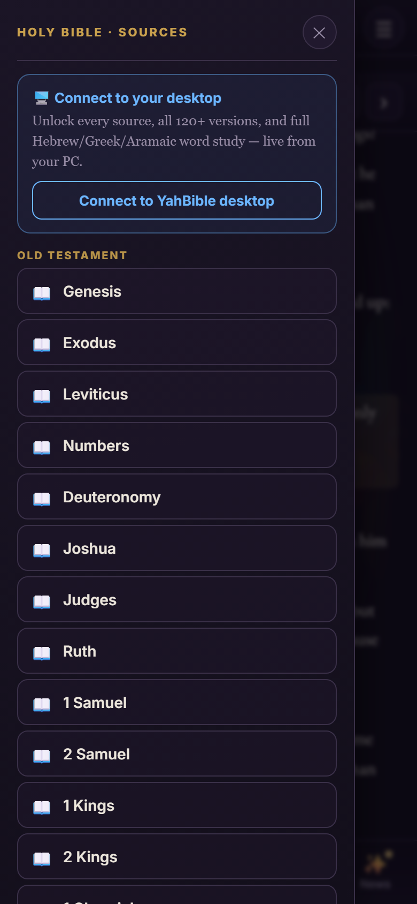
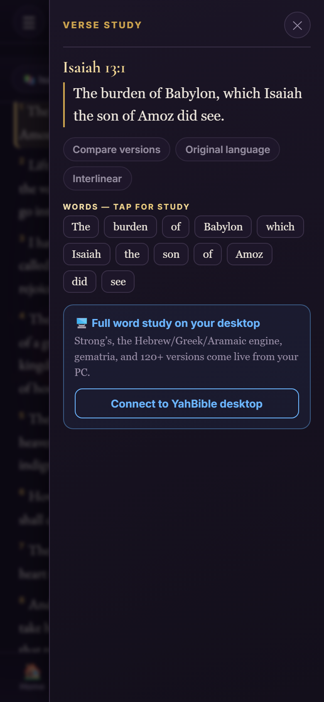

# YahBible Mobile — the Word in your pocket, free & offline

**Study the Word anywhere — the whole Bible and a heart-deep study, with no internet and no cost.**

YahBible Mobile is a free Android app that carries the entire **King James Bible**, the **Ten
Commandments** studied as living questions, and a complete teaching on **Repentance** — all bundled
inside the app. No account. No ads. No connection required. Just download one file and open it.


> **Free & pre-release.** The mobile companion to the
> [YahBible desktop edition](https://huggingface.co/OhBeOneKeyNoBe/YahBible).

---

## 📥 Get it — free in three taps

**[⬇️ Download the latest APK](https://github.com/OhBeOneKeyNoBe/YahBible-Mobile/releases/latest)** &nbsp;·&nbsp; also on [Hugging Face](https://huggingface.co/OhBeOneKeyNoBe/YahBible-Mobile)

1. On your Android phone, download **`YahBible-v0.1-debug.apk`** from the link above.
2. **Tap the file.** If Android asks, allow **Install unknown apps** for your browser or Files app.
3. **Open YahBible.** That's it — it works with no internet.

*Requires Android 8.0+. Free — no account, no ads, no tracking. Everything runs on your own phone.*

---

## ✨ What you can do with it

### The whole King James Bible — offline
All **66 books and 31,102 verses** live inside the app. Pick a book, pick a chapter, and read — with
verse highlighting and one-tap next/previous. **Every scripture reference** anywhere in the app is a
link that opens the reader at that exact verse.


### The full study desk — sources & word study, like the desktop
A **sources** menu on the left (every book, and — connected to your desktop — the Ethiopian
Apocrypha, the Red Letter Words, the Enoch and Gnostic scriptures, and 120+ versions), and a
**verse-study** panel on the right: tap any verse to see its words, compare versions, and open the
original Hebrew or Greek. When paired with your desktop, the full engine comes live.




### The Ten Commandments — studied as questions
Each commandment opens as a study of clear questions — *“What is Adultery?”*, *“How do you keep this
commandment?”*, and *“How is it broken?”* — answered plainly, with the scripture behind each answer.


### The seven inward dimensions
Every commandment is examined through seven dimensions of the heart — 🔴 Physical, 🟠 Emotional,
🟡 Mental, 🟢 Ambitional, 🔵 Vocal, 🟣 Intentional, 🟪 Spiritual — each with real examples,
scripture, and how to keep it.


### See where sin begins — before it ever shows
An interactive figure of the person in **seven nested layers**, spirit at the core (violet) to flesh
on the surface (scarlet). Tap a layer to open its dimension — and learn that what appears in the body
was forming inwardly long before.


### The inward ladder — catch it earlier
Temptation is a countdown from the spirit to the act — **7 down to 1**. The deeper you learn to see,
the earlier you can turn. Repentance can begin at 7, long before it ever reaches 1.


### Seeking the Father's Counsel
A guided path in three steps — **Adoption, Counsel, and Blessings** — with the full Lord's Prayer and
a private *Seek Counsel in Prayer* flow drawn from Matthew 6.


### News & Updates
A built-in feed of what's new, so the app tells you as it grows — the tab gently marks itself until
you've read the latest.


Plus a **draggable self-cam overlay** (circle or green-screen) for streaming your study on TikTok and
elsewhere.

---

## Why it's for you

- **The whole Bible in your pocket — truly offline.** Read anywhere, with no signal and no data.
- **A study that goes to the heart.** Not just what the commandments say, but where they break inside
  us — and how to turn back, early.
- **Free, private, and yours.** No account, no ads, no tracking; everything runs on your own phone.
- **Grows with you.** The mobile companion to the ever-expanding YahBible desktop edition.

---

## Links
- **Download & releases (here):** https://github.com/OhBeOneKeyNoBe/YahBible-Mobile/releases/latest
- **Hugging Face:** https://huggingface.co/OhBeOneKeyNoBe/YahBible-Mobile
- **Desktop edition:** https://huggingface.co/OhBeOneKeyNoBe/YahBible
- **Home:** [www.RealizeUS.me/@yahwehtsidkenu](https://www.RealizeUS.me/@yahwehtsidkenu)

<details>
<summary>For developers</summary>

The app is a native Android WebView (`android/`) wrapping the offline web UI in `www/`. To build the
APK yourself you need JDK 17 and the Android SDK (platform-34, build-tools 34 — no NDK):

```bash
cd android
echo "sdk.dir=/path/to/Android/sdk" > local.properties
./gradlew assembleDebug     # -> app/build/outputs/apk/debug/app-debug.apk
```
</details>

---

*A work of Yahweh Tsidkenu · free & offline · **[www.RealizeUS.me/@yahwehtsidkenu](https://www.RealizeUS.me/@yahwehtsidkenu)***
